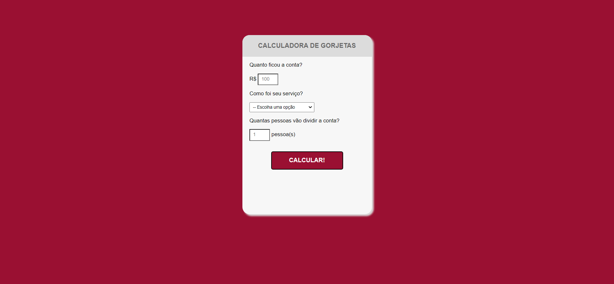

<h1 align="center"> Calculadora de Gorjetas </h1>

Projeto desenvolvido na 'Start na Programação' da OneBitCode

  <a href="#-tecnologias">Tecnologias</a>&nbsp;&nbsp;&nbsp;|&nbsp;&nbsp;&nbsp;
  <a href="#-projeto">Projeto</a>&nbsp;&nbsp;&nbsp;|&nbsp;&nbsp;&nbsp;
  <a href="#memo-licença">Licença</a>

  

 

  

## 🚀 Tecnologias

Esse projeto foi desenvolvido com as seguintes tecnologias:

- HTML 
- CSS
- JavaScript

## 💻 Projeto

Esse projeto apresenta uma calculadora de gorjetas simples.

## :memo: Licença

Esse projeto está sob a licença MIT.

---

Feito por [Isa Kaillany](https://github.com/IsaKaillany)